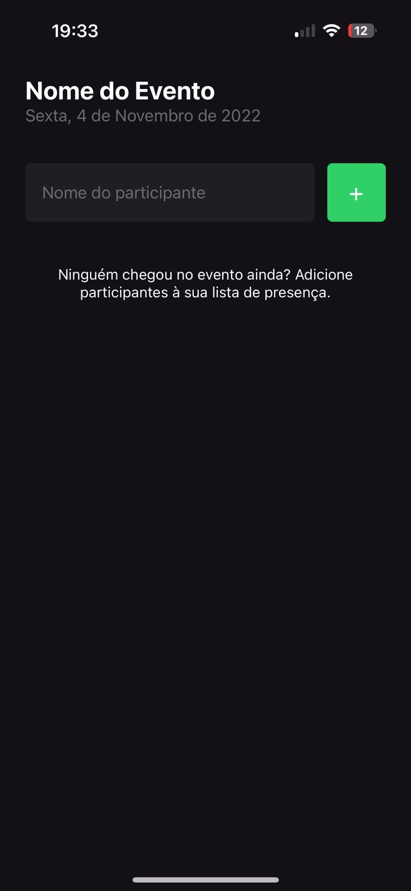
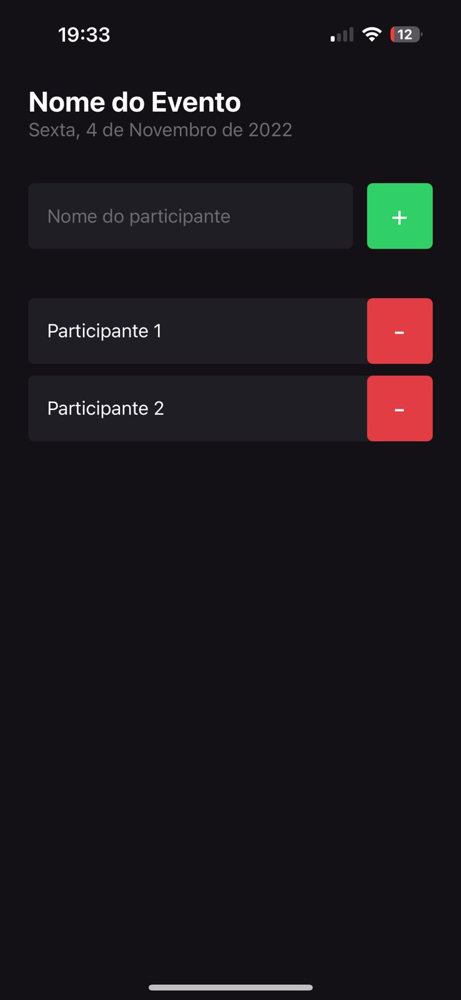
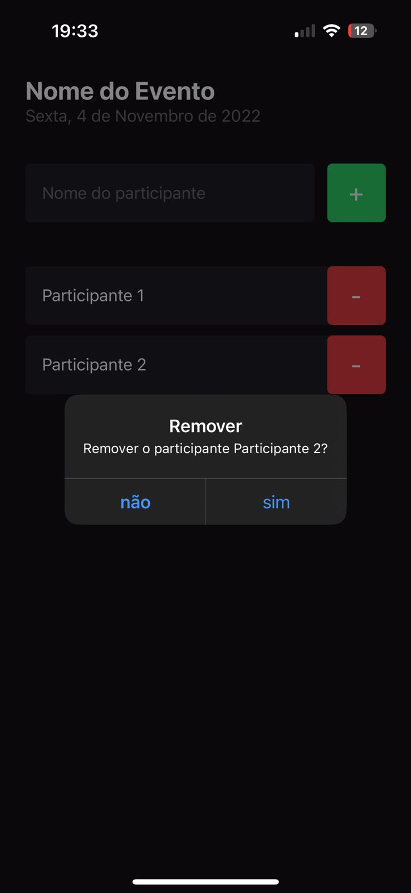

# react-lista-presenca
> Projeto inicial do curso de React Native da Rocketseat.

O Programa consiste em uma lista de presenças de um determinado evento, no qual o usuário pode adicionar ou remover participantes.

    

